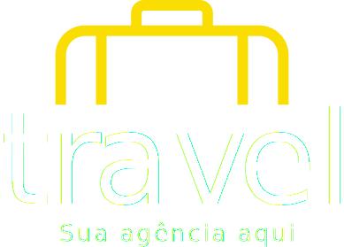

# Projeto Agencia Turismo

Este Projeto foi desenvolvido por projeto pessoal  e o objetivo principal é demonstrar as minhas habilidades.
# Como rodar este projeto?
    Clone este repositório: 
- git clone projeto-agencia-turismo

 ## Criação do projeto
 -   npm create vite@latest

 ## Acesse a pasta do seu projeto no seu terminal
 -   cd projeto-agencia-turismo

 ## Instale as dependências
 -   npm install

 ## Execute a aplicação
   Desenvolvimento:
   -  npm run dev  

## A Aplicação será iniciada na porta  5173, acesse pelo navegador:
  -   http://localhost:5173/      

## Documentações das Ferramentas:
- [vite](https://vitejs.dev/)
- [React](https://react.dev/)
- [React Router](https://reactrouter.com/en/main)

## Tecnologias utilizadas

1. 

1. 

1. 

1. 

1. 

## Components:

- Criação do Componente Header
- Criação do Componente Footer

## Status do projeto
- Projeto em construção

